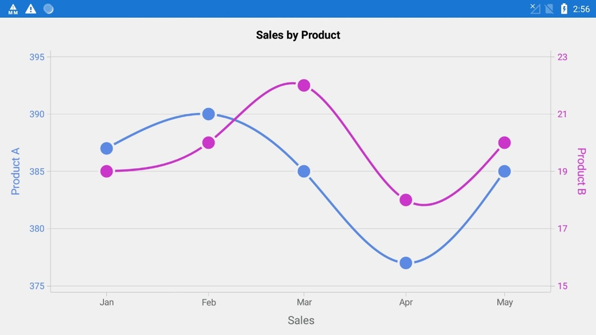

# How-to-make-a-graph-with-multiple-axes-with-Xamarin.Forms-Charts

This article explains how to add the multiple Y axes in Xamarin.Forms Charts. 

Consider the use case to plot the graph for two products with different unit sales rate on the specific month as shown in below. It has been achieved by using the XAxis and YAxis of the series.

 

By default, Cartesian series made using SfChart's PrimaryAxis and SecondaryAxis. 

## How to add the multi y-axis in Xamarin.Forms Chart in using XAML

Step 1: Declare the default PrimaryAxis and SecondaryAxis of SfChart with its customization.
```
…
<chart:SfChart.PrimaryAxis>
      <chart:DateTimeAxis Interval="1"  IntervalType="Months" /> 
</chart:SfChart.PrimaryAxis>

<chart:SfChart.SecondaryAxis>
      <chart:NumericalAxis Interval="5"  />
</chart:SfChart.SecondaryAxis>
…
```
Step 2: Declaration to add y-axis for the required Series.
```
…
<chart:SfChart.Series>
       <chart:SplineSeries ItemsSource="{Binding Data}" XBindingPath="XValue" YBindingPath="YValue2" Color="#d938d6" StrokeWidth="3" Label="Bullet">
            <chart:SplineSeries.YAxis>
                    <chart:NumericalAxis OpposedPosition="true" Minimum="15" Maximum="23" Interval="2" EdgeLabelsDrawingMode="Fit">
                     </chart:NumericalAxis>
              </chart:SplineSeries.YAxis>
         </chart:SplineSeries>
</chart:SfChart.Series>
…
```
## How to add the multi y-axis in Xamarin.Forms Chart in using C#

The following C# code example shows how to Add y-axis (or intend of x-axis) property added in chart series.
```
…
SplineSeries splineSeries = new SplineSeries();
splineSeries.ItemsSource = viewModel.Data;
splineSeries.XBindingPath = "XValue";
splineSeries.YBindingPath = "YValue";
splineSeries.YAxis = new NumericalAxis()
{
       Minimum = 15,
       Maximum = 23,
       Interval = 2,
       IsVertical = true,
       OpposedPosition = true
};
…
```
## See also

[Adding duplicate axis in SfChart](https://help.syncfusion.com/xamarin/charts/how-to/adding-duplicate-axis-in-sfchart)

[How to customize the axis label format based on the culture in Xamarin.Forms Chart (SfChart)](https://www.syncfusion.com/kb/11289/how-to-customize-the-axis-label-format-based-on-the-culture-in-xamarin-forms-chart-sfchart)

[How to customize the axis labels](https://www.syncfusion.com/kb/5545/how-to-customize-the-axis-labels)

[How to plot date-time values in vertical axes](https://www.syncfusion.com/kb/8732/how-to-plot-date-time-values-in-vertical-axes)

[How to change the data point selection color](https://www.syncfusion.com/kb/8732/how-to-plot-date-time-values-in-vertical-axes)
